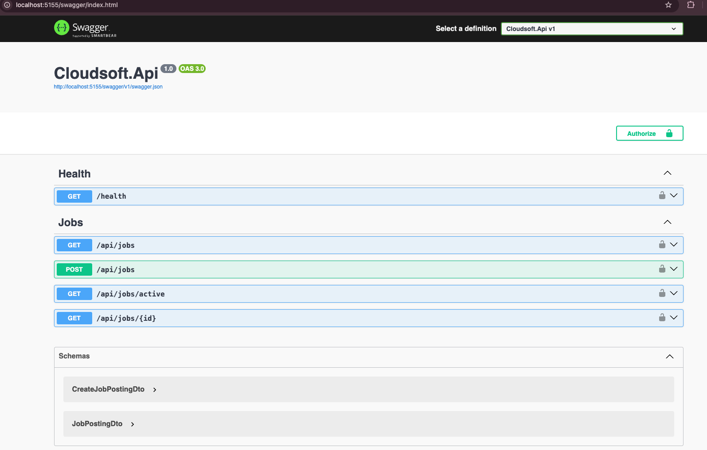

# Cloudsoft REST API With MVC

## Overview

The Cloudsoft API exposes job posting data from `Cloudsoft.Api`.

The exposed resource is the job posting resource. This was chosen because job postings are the main public data in the Cloudsoft Job application: visitors need to browse available jobs, external clients may need to read active postings, and trusted clients may need to create new postings. A job posting is also a stable business concept with clear fields such as title, description, location, deadline, and active status.

The API does not expose employer accounts, login state, applicant CV uploads, or internal storage details. Those parts either contain sensitive data or belong to browser workflows in the MVC web app. Keeping the API focused on job postings makes the contract smaller, easier to document, and safer to consume.

The API uses DTOs as its public contract:

- `CreateJobPostingDto` is used when creating a job posting.
- `JobPostingDto` is returned from job endpoints.
- `JobPosting` remains the internal domain model in `Cloudsoft.Core`.

This keeps the public API contract separate from the internal domain model. The domain entity can change to support internal business rules, persistence, or employer ownership without automatically changing the JSON shape that API consumers depend on.

## Swagger

Swagger/OpenAPI documentation is generated with `Swashbuckle.AspNetCore`.

The API registers controller discovery and Swagger generation in `src/Cloudsoft.Api/Program.cs`:

```csharp
builder.Services.AddEndpointsApiExplorer();
builder.Services.AddSwaggerGen(options =>
{
    options.AddSecurityDefinition("ApiKey", new Microsoft.OpenApi.Models.OpenApiSecurityScheme
    {
        Description = "API key needed to access protected endpoints. Use: X-API-Key: <key>",
        Name = "X-API-Key",
        In = Microsoft.OpenApi.Models.ParameterLocation.Header,
        Type = Microsoft.OpenApi.Models.SecuritySchemeType.ApiKey,
        Scheme = "ApiKey"
    });

    options.AddSecurityRequirement(new Microsoft.OpenApi.Models.OpenApiSecurityRequirement
    {
        {
            new Microsoft.OpenApi.Models.OpenApiSecurityScheme
            {
                Reference = new Microsoft.OpenApi.Models.OpenApiReference
                {
                    Type = Microsoft.OpenApi.Models.ReferenceType.SecurityScheme,
                    Id = "ApiKey"
                }
            },
            Array.Empty<string>()
        }
    });
});
```

At runtime, the middleware exposes the generated OpenAPI JSON and Swagger UI:

```csharp
app.UseSwagger();
app.UseSwaggerUI();
```

Swashbuckle reads the controller routes, HTTP attributes, action method signatures, DTO properties, validation attributes, and configured API-key security definition. That produces a browsable API page and a machine-readable OpenAPI document.

Run the API:

```bash
dotnet run --project src/Cloudsoft.Api
```

Open Swagger UI:

```text
http://localhost:5155/swagger/index.html
```

The HTTPS profile also exposes:

```bash
dotnet run --project src/Cloudsoft.Api --launch-profile https
```

```text
https://localhost:7036/swagger/index.html
```

The OpenAPI JSON document is available at:

```text
http://localhost:5155/swagger/v1/swagger.json
```

A consumer finds the API by opening Swagger UI, reviewing the available operations under `api/jobs`, expanding an endpoint, and using **Try it out**. For public `GET` endpoints, no credentials are required. For protected write endpoints, the consumer clicks **Authorize**, enters the API key value, and then calls `POST /api/jobs` with a JSON request body.

## Authentication

Read endpoints are public.

Write endpoints require an API key in this header:

```http
X-API-Key: <configured-write-api-key>
```

The key is read by `ApiKeyAuthenticationHandler` from the `ApiAuth` configuration section:

```text
ApiAuth__WriteApiKey=<secret-value>
```

In code, the options object is registered in `Program.cs`:

```csharp
builder.Services.Configure<ApiAuthOptions>(builder.Configuration.GetSection(ApiAuthOptions.SectionName));
```

Authentication and authorization are enabled with:

```csharp
builder.Services
    .AddAuthentication(ApiKeyAuthenticationDefaults.AuthenticationScheme)
    .AddScheme<AuthenticationSchemeOptions, ApiKeyAuthenticationHandler>(
        ApiKeyAuthenticationDefaults.AuthenticationScheme,
        options => { });
builder.Services.AddAuthorization();
```

The request pipeline then runs the authentication and authorization middleware:

```csharp
app.UseAuthentication();
app.UseAuthorization();
```

Only the create endpoint is protected:

```csharp
[HttpPost]
[Authorize]
public async Task<ActionResult<JobPostingDto>> Create(CreateJobPostingDto dto)
```

The handler checks the configured key, reads the `X-API-Key` request header, compares the header value with the configured value, and creates an authenticated `api-client` principal when they match.

The production key should be stored outside source control, for example as an environment variable, Azure Container Apps secret, GitHub Actions secret, or Azure Key Vault secret. `src/Cloudsoft.Api/appsettings.json` keeps `ApiAuth:WriteApiKey` empty, so a real production key is not committed to the repository. Local development can use `appsettings.Development.json` or an environment variable, but production secrets should not be written into tracked files.

Missing or invalid API keys return:

```http
401 Unauthorized
```

### Configure API Key Locally

For local development, either use the development key from `src/Cloudsoft.Api/appsettings.Development.json` or override it with an environment variable:

```bash
export ApiAuth__WriteApiKey="test-api-write-key"
```

Then run the API from the same terminal:

```bash
dotnet run --project src/Cloudsoft.Api
```

Protected endpoints must include the configured key in the `X-API-Key` header.

Example:

```bash
curl -X POST http://localhost:5155/api/jobs \
  -H "Content-Type: application/json" \
  -H "X-API-Key: test-api-write-key" \
  -d '{
    "title": "Software Developer",
    "description": "Build and maintain web applications.",
    "location": "Stockholm",
    "deadline": "2026-06-30",
    "isActive": true
  }'
```

### Missing API Key Log

This log means a protected endpoint was called without the `X-API-Key` header:

```text
Cloudsoft.Api.Authentication.ApiKeyAuthenticationHandler[7]
      ApiKey was not authenticated. Failure message: API key is missing.
```

Fix it by sending this header with protected requests:

```http
X-API-Key: test-api-write-key
```

Public `GET` endpoints do not need an API key. `POST /api/jobs` does need an API key.

### Swagger API Key Support

Swagger UI includes an `Authorize` button because `Program.cs` configures an API-key security definition named `ApiKey`.

Open Swagger:

```text
http://localhost:5155/swagger/index.html
```

Click `Authorize` and enter only the key value:

```text
test-api-write-key
```

Do not enter `X-API-Key: test-api-write-key` in the Swagger authorize box.

## DTOs

DTOs live in `src/Cloudsoft.Api/Dtos`. The domain entity lives separately in `src/Cloudsoft.Core/Models/JobPosting.cs`. The mapping code in `JobPostingDtoMapping` is the boundary between the API contract and the domain model:

```csharp
public static JobPostingDto ToDto(this JobPosting jobPosting)
```

```csharp
public static JobPosting ToModel(this CreateJobPostingDto dto)
```

This separation matters because API consumers should not receive every internal field. For example, `CreateJobPostingDto` does not let the client send `id`, `createdAtUtc`, or `employerId`; those values are controlled by the server and the application workflow. `JobPostingDto` also avoids exposing internal persistence details or employer account data.

### CreateJobPostingDto

Used as the request body for `POST /api/jobs`.

```json
{
  "title": "Software Developer",
  "description": "Build and maintain web applications.",
  "location": "Stockholm",
  "deadline": "2026-06-30",
  "isActive": true
}
```

Fields:

| Field | Type | Required | Notes |
| --- | --- | --- | --- |
| `title` | string | Yes | Job title. |
| `description` | string | Yes | Job description. |
| `location` | string | Yes | Job location. |
| `deadline` | date/time | Yes | Final application date. |
| `isActive` | boolean | No | Defaults to `true`. |

The client does not send `id`, `createdAtUtc`, or `employerId`.

### JobPostingDto

Returned from job endpoints.

```json
{
  "id": "8f6f2c7e-4d4e-4c46-90f8-99bb2b86cb91",
  "title": "Software Developer",
  "description": "Build and maintain web applications.",
  "location": "Stockholm",
  "createdAtUtc": "2026-05-25T14:00:00Z",
  "deadline": "2026-06-30T00:00:00Z",
  "isActive": true
}
```

Fields:

| Field | Type | Notes |
| --- | --- | --- |
| `id` | string | Server-generated job posting ID. |
| `title` | string | Job title. |
| `description` | string | Job description. |
| `location` | string | Job location. |
| `createdAtUtc` | date/time | UTC timestamp when the posting was created. |
| `deadline` | date/time | Final application date. |
| `isActive` | boolean | Whether the posting is active. |

`employerId` is not exposed in the API response DTO.

## Job Endpoints

### Get All Jobs

```http
GET /api/jobs
```

Returns all job postings.

Response:

```http
200 OK
Content-Type: application/json
```

```json
[
  {
    "id": "8f6f2c7e-4d4e-4c46-90f8-99bb2b86cb91",
    "title": "Software Developer",
    "description": "Build and maintain web applications.",
    "location": "Stockholm",
    "createdAtUtc": "2026-05-25T14:00:00Z",
    "deadline": "2026-06-30T00:00:00Z",
    "isActive": true
  }
]
```

### Get Active Jobs

```http
GET /api/jobs/active
```

Returns only active job postings where `isActive` is `true`.

Response:

```http
200 OK
Content-Type: application/json
```

```json
[
  {
    "id": "8f6f2c7e-4d4e-4c46-90f8-99bb2b86cb91",
    "title": "Software Developer",
    "description": "Build and maintain web applications.",
    "location": "Stockholm",
    "createdAtUtc": "2026-05-25T14:00:00Z",
    "deadline": "2026-06-30T00:00:00Z",
    "isActive": true
  }
]
```

### Get Job By ID

```http
GET /api/jobs/{id}
```

Returns one job posting.

Successful response:

```http
200 OK
Content-Type: application/json
```

```json
{
  "id": "8f6f2c7e-4d4e-4c46-90f8-99bb2b86cb91",
  "title": "Software Developer",
  "description": "Build and maintain web applications.",
  "location": "Stockholm",
  "createdAtUtc": "2026-05-25T14:00:00Z",
  "deadline": "2026-06-30T00:00:00Z",
  "isActive": true
}
```

When the job posting does not exist:

```http
404 Not Found
```

### Create Job

```http
POST /api/jobs
X-API-Key: <configured-write-api-key>
Content-Type: application/json
```

Request body:

```json
{
  "title": "Software Developer",
  "description": "Build and maintain web applications.",
  "location": "Stockholm",
  "deadline": "2026-06-30",
  "isActive": true
}
```

Successful response:

```http
201 Created
Location: /api/jobs/{id}
Content-Type: application/json
```

```json
{
  "id": "8f6f2c7e-4d4e-4c46-90f8-99bb2b86cb91",
  "title": "Software Developer",
  "description": "Build and maintain web applications.",
  "location": "Stockholm",
  "createdAtUtc": "2026-05-25T14:00:00Z",
  "deadline": "2026-06-30T00:00:00Z",
  "isActive": true
}
```

The server generates the `id` and `createdAtUtc` values.

Validation errors return:

```http
400 Bad Request
```

Missing or invalid API keys return:

```http
401 Unauthorized
```

## Implementation Notes

The API controller maps between DTOs and the domain model:

```csharp
public static JobPostingDto ToDto(this JobPosting jobPosting)
```

```csharp
public static JobPosting ToModel(this CreateJobPostingDto dto)
```

The controller methods use DTOs:

```csharp
public async Task<IReadOnlyCollection<JobPostingDto>> GetAll()
public async Task<IReadOnlyCollection<JobPostingDto>> GetActive()
public async Task<ActionResult<JobPostingDto>> GetById(string id)
public async Task<ActionResult<JobPostingDto>> Create(CreateJobPostingDto dto)
```

The exposed resource and protection model are intentionally small:

- `GET /api/jobs`, `GET /api/jobs/active`, and `GET /api/jobs/{id}` are public read operations.
- `POST /api/jobs` is the only write operation and requires `X-API-Key`.
- The API key is configured through `ApiAuth:WriteApiKey`.
- Real production keys are kept out of version control by using environment variables or Azure-hosted secret storage.


