<div align="center">

# Cloudsoft-Job

### Home Page View

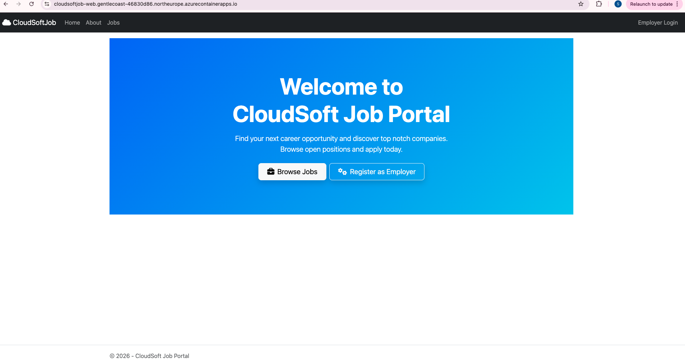

## CLO25 Molnapplikationer fördjupning

### Layered ASP.NET Core MVC application with Domain, Application, Infrastructure, and Web projects.  
### Api, Core, Web, Test

## Stephen Uche Osedumme

</div>

<div style="page-break-after: always;"></div>

# Table of Contents

1. [Architecture Review And Reflection](#architecture-review-and-reflection)
2. [Cloudsoft REST API With MVC](#cloudsoft-rest-api-with-mvc)
3. [File Upload And Health Probes](#file-upload-and-health-probes)
4. [Make the Application Observable](#make-the-application-observable)

<div style="page-break-after: always;"></div>

# Architecture Review And Reflection

Layered ASP.NET Core MVC application with Domain, Application, Infrastructure, and Web projects.(Api, Core, Web, Test)

## Cloudsoft-Job System Diagram

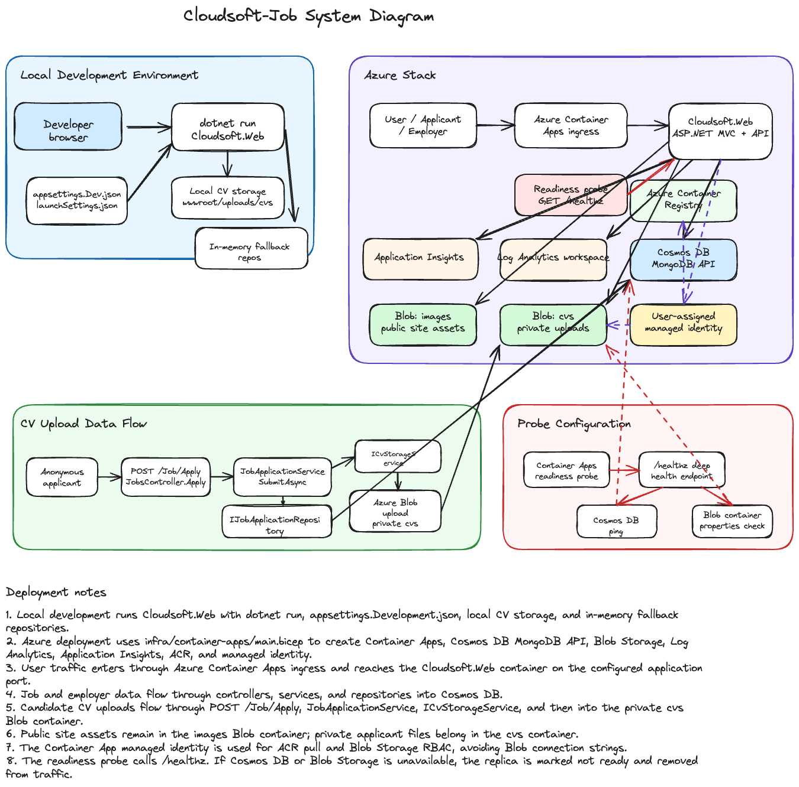

### About Page View
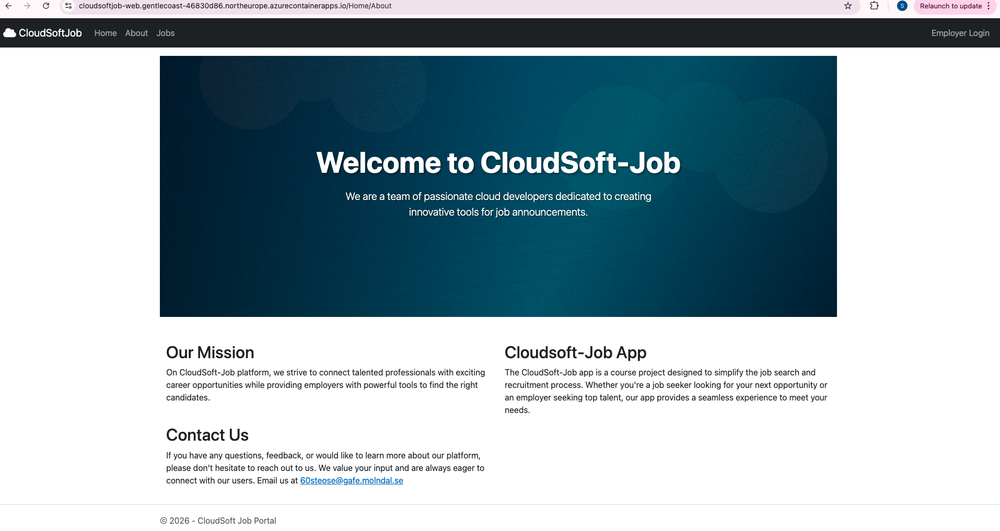

## Architecture Review

Cloudsoft Job is a layered ASP.NET Core application with a web front end, an API surface, a core service layer, repository abstractions, and Azure infrastructure defined in Bicep. The system is split so that HTTP concerns stay in the MVC and API projects, business operations stay in `Cloudsoft.Core`, and deployment concerns stay in `infra/container-apps`.

The MVC layer is the main user-facing path. `JobsController` handles job listing, job details, employer job creation, job activation changes, and applicant CV submission. The API layer exposes job data through `src/Cloudsoft.Api/Controllers/JobsController.cs`, using DTOs from `src/Cloudsoft.Api/Dtos`. Both layers depend on service interfaces such as `IJobPostingService` and `IJobApplicationService` instead of directly talking to persistence. That keeps request handling thin and lets the service layer own business rules.

The core service layer coordinates validation and persistence. `JobApplicationService.SubmitAsync` is the clearest example: it trims and validates applicant input, checks that the job exists and is still accepting applications, prevents duplicate applications, saves the CV through `ICvStorageService`, and then persists the application through `IJobApplicationRepository`. The service does not need to know whether the CV is written to disk locally or to Azure Blob Storage in production. That responsibility is behind the storage abstraction.

Persistence is built around repository interfaces. `IJobPostingRepository`, `IJobApplicationRepository`, and `IEmployerRepository` hide the storage implementation from the service layer. The app can run with in-memory repositories for local development and tests, or MongoDB-backed repositories for Azure. The resilient repository implementations wrap MongoDB repositories and fall back to in-memory storage when MongoDB operations fail, logging the failure with structured `LogError` calls. In Azure, MongoDB is provided by Cosmos DB with the MongoDB API.

The Azure stack is deployed through `infra/container-apps/main.bicep`. The template creates the Container Apps environment, Azure Container Registry, Cosmos DB, Log Analytics, Application Insights, and Blob Storage. The Container App receives configuration through environment variables and secrets. Cosmos DB connection details are passed as a secret, while Blob container URLs are passed as normal configuration because the URL itself is not a credential.

For file upload, the finished design uses the existing job application flow and changes only the storage implementation. Applicants upload CV files through `POST /Job/Apply`. The MVC controller passes the file stream into `JobApplicationService`, which uses `ICvStorageService`. In local development, that storage implementation writes under `wwwroot/uploads/cvs`. In Azure, the production implementation writes the CV to a private `cvs` Blob container. The existing public `images` container remains only for public image assets such as `hero.png`.

Blob Storage access is designed around managed identity rather than connection strings. The Container App has a user-assigned managed identity. The identity is granted `Storage Blob Data Contributor` for the CV container or storage account. The app uses `DefaultAzureCredential`, so Azure SDK calls acquire a token from the Container Apps managed identity at runtime. This means the app does not need a storage account key, shared access signature, or Blob connection string for CV uploads.

The health model separates shallow process health from deep dependency readiness. A deep `/healthz` probe checks whether the app can reach Cosmos DB and Blob Storage. The Cosmos check verifies the configured MongoDB endpoint by running a cheap ping-style operation. The Blob check verifies the configured CV container by reading container properties through the same managed identity path used by uploads. If both checks pass, `/healthz` returns `200 OK`. If either required dependency fails, it returns `503 Service Unavailable`.

Container Apps connects that deep endpoint to the readiness probe. The readiness probe calls `/healthz` on the app container. If Cosmos DB or Blob Storage is unavailable, the probe fails and the replica is marked not ready. Container Apps then removes that replica from traffic rotation. If other replicas are healthy, traffic continues to those replicas. If every replica fails readiness, the revision has no ready backend and users receive service failures until a replica becomes healthy again.

### Jobs Page View

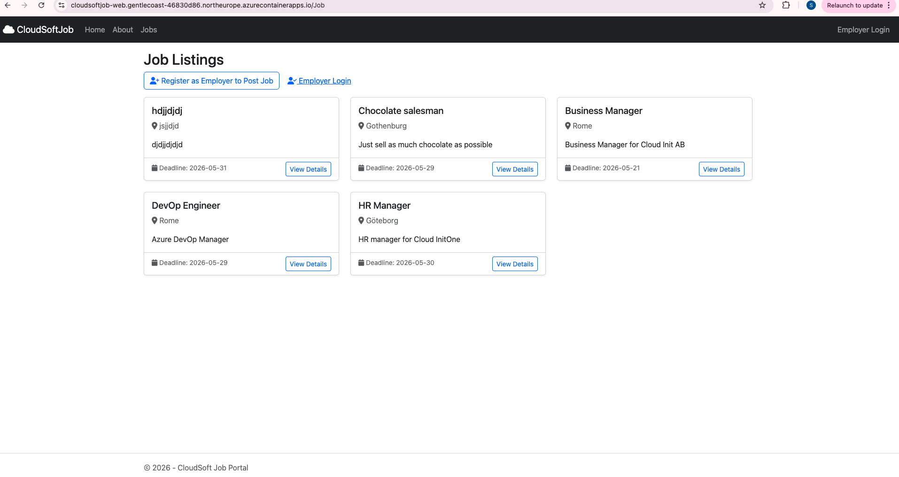

### Employer Login View

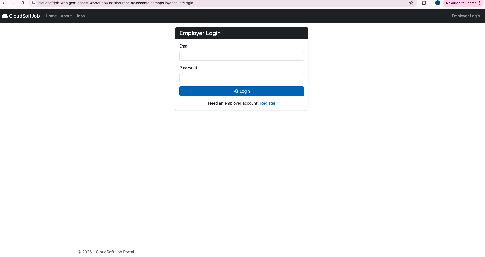

### Employer Admin View

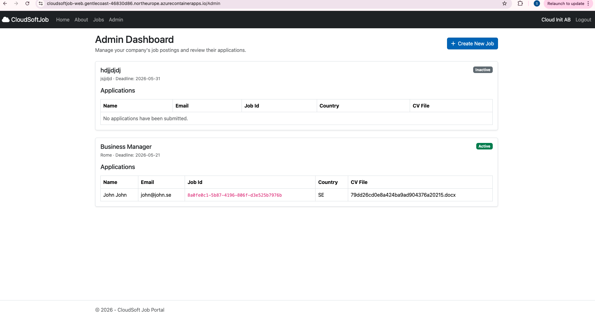

### Employer Create Page View

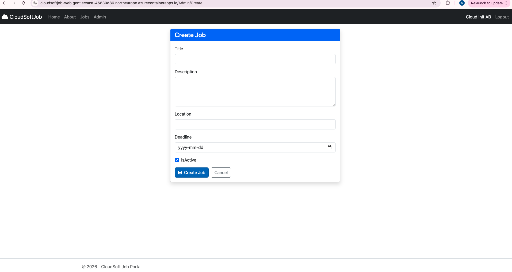

### Job Details And Apply Page View

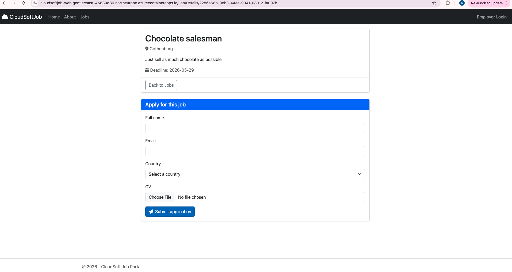

## Reflection

The application now fits together as a conventional layered cloud web application. A request first enters through either the local development server or Azure Container Apps ingress. In Azure, ingress routes the request to a ready Container App replica. ASP.NET Core middleware handles static files, routing, authentication, and authorization before the request reaches MVC or API controllers.

For browser users, MVC controllers are the main entry point. Anonymous users can browse job postings and submit applications. Employer users authenticate with cookie authentication and can create or manage postings.  

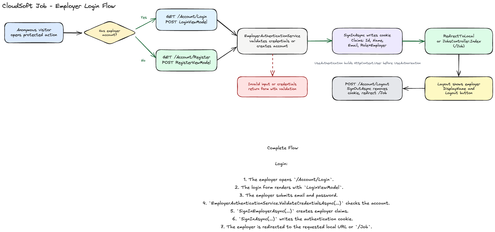

For API consumers, `Cloudsoft.Api.Controllers.JobsController` exposes job data and uses DTOs to avoid returning domain models directly. Both entry points are intentionally thin: they receive HTTP input, call services, and shape HTTP responses.

The service layer is where the application behavior becomes explicit. `JobPostingService` owns job posting operations. `JobApplicationService` owns application submission and CV handling. That keeps validation and workflow decisions out of the controllers. The CV upload path shows the full chain: the browser sends `POST /Job/Apply`, `JobsController.Apply` reads the uploaded `IFormFile`, `JobApplicationService.SubmitAsync` validates the applicant and job state, `ICvStorageService` stores the CV, and `IJobApplicationRepository` saves the application record.

The repository layer is the boundary to data storage. The services depend on repository interfaces, not concrete MongoDB classes. In local development and tests, the app can use in-memory repositories. In Azure, feature flags select MongoDB-backed repositories using Cosmos DB's MongoDB API. The resilient repositories add a pragmatic reliability layer by catching MongoDB failures, logging them, and falling back to in-memory storage. This is useful operationally because it makes dependency problems visible in logs while keeping the application structure simple.

Blob Storage is a separate storage concern from Cosmos DB. Cosmos DB stores structured application data: jobs, employers, and job applications. Blob Storage stores file objects: public images in the `images` container and private CV files in the `cvs` container. This split is appropriate because CVs are binary documents, not database records. The database keeps the metadata and blob name, while Blob Storage owns the file contents.

The deployment architecture follows the same separation. Bicep creates infrastructure, GitHub Actions builds and pushes the container image, and Container Apps runs the app. Configuration flows into the container through environment variables and secrets. `FeatureFlags__UseMongoDb` and `FeatureFlags__UseAzureStorage` decide which infrastructure-backed behavior is active. Application Insights and Log Analytics receive telemetry, while `/healthz` gives the platform a direct readiness signal.

Several design patterns and techniques are visible in the codebase:

- Repository: `IJobPostingRepository`, `IJobApplicationRepository`, and `IEmployerRepository` isolate persistence from business services.
- Dependency Injection: `Program.cs` registers services, repositories, authentication, storage services, options, and telemetry. Controllers and services receive dependencies through constructors.
- DTO: `JobPostingDto`, `CreateJobPostingDto`, and `JobPostingDtoMapping` separate API contracts from domain models.
- Feature Flag: `FeatureFlagsOptions` and `FeatureFlags__UseMongoDb` / `FeatureFlags__UseAzureStorage` switch between local and Azure-backed implementations.
- Managed Identity: the Container App identity pulls from ACR and is the intended identity for Blob Storage access without connection strings.
- Deep Probe: `/healthz` represents dependency-aware readiness by checking Cosmos DB and Blob Storage instead of only checking that the process is alive.
- Middleware: ASP.NET Core middleware handles static files, routing, authentication, authorization, exception handling, HTTPS redirection, and request dispatch before controllers run.

The result is a system where the same app can run locally with simple dependencies and in Azure with managed platform services. The important boundaries are clear: controllers handle HTTP, services handle workflows, repositories handle data access, storage abstractions handle files, and infrastructure code wires the app to Azure services. That makes the application easier to test, deploy, and reason about when a dependency such as Cosmos DB or Blob Storage becomes unavailable.

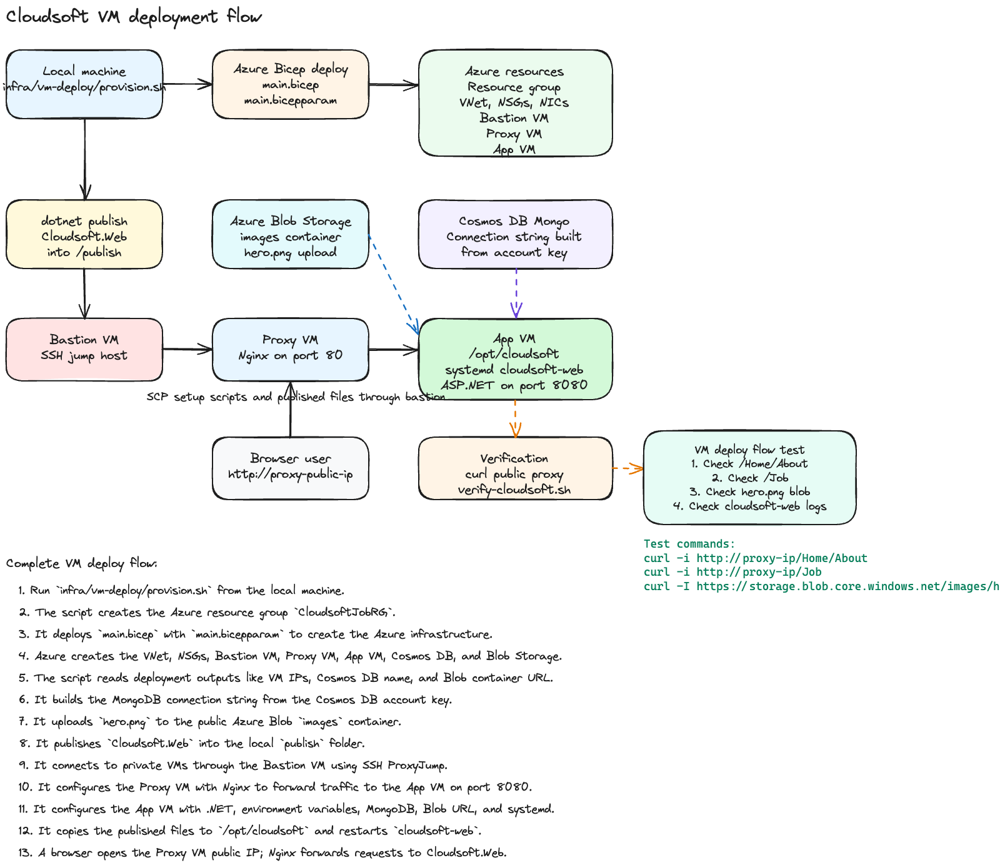

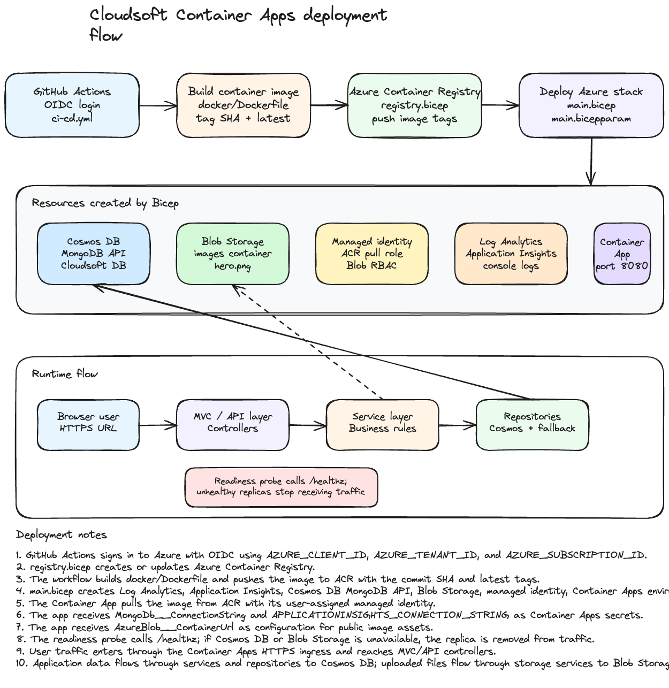

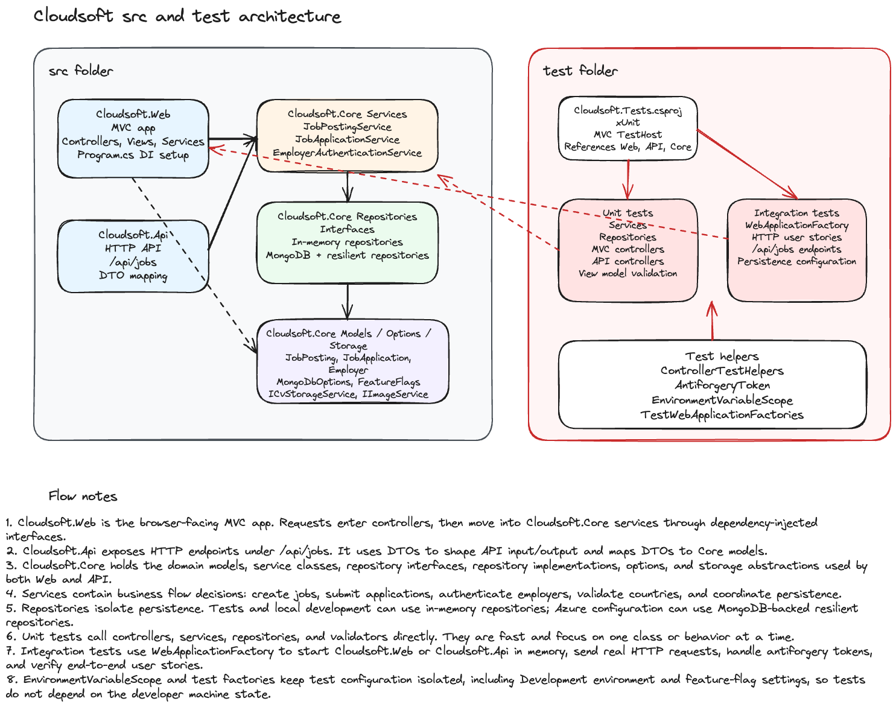

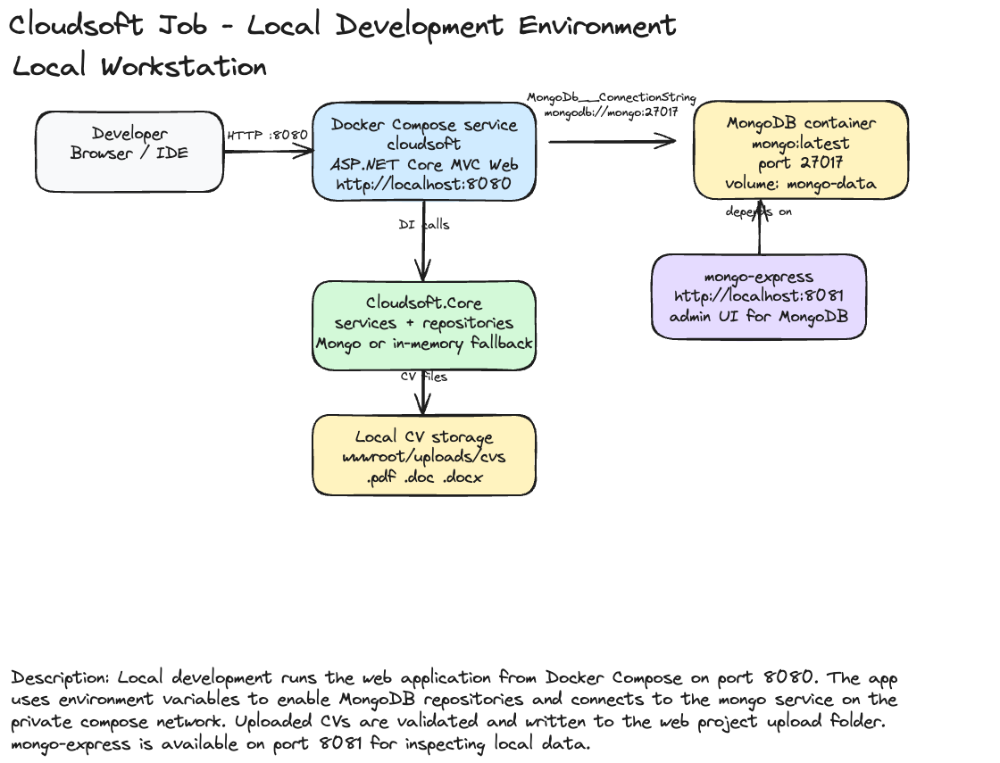

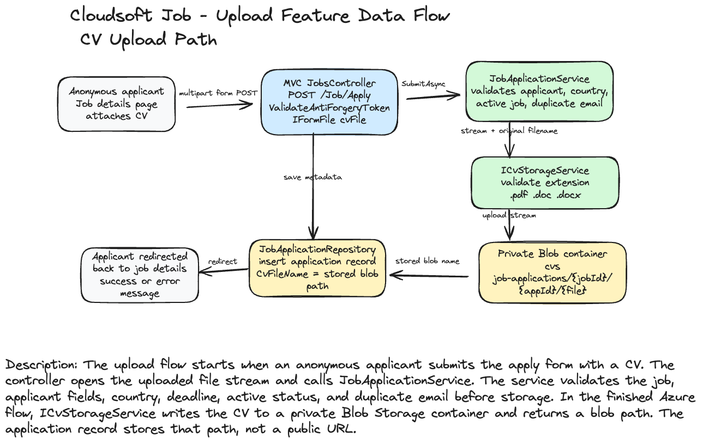


<div style="page-break-before: always;"></div>

# Cloudsoft REST API With MVC

## Overview

The Cloudsoft API exposes job posting data from `Cloudsoft.Api`.

The exposed resource is the job posting resource. This was chosen because job postings are the main public data in the Cloudsoft Job application: visitors need to browse available jobs, external clients may need to read active postings, and trusted clients may need to create new postings. A job posting is also a stable business concept with clear fields such as title, description, location, deadline, and active status.

The API does not expose employer accounts, login state, applicant CV uploads, or internal storage details. Those parts either contain sensitive data or belong to browser workflows in the MVC web app. Keeping the API focused on job postings makes the contract smaller, easier to document, and safer to consume.

The API uses DTOs as its public contract:

- `CreateJobPostingDto` is used when creating a job posting.
- `JobPostingDto` is returned from job endpoints.
- `JobPosting` remains the internal domain model in `Cloudsoft.Core`.

This keeps the public API contract separate from the internal domain model. The domain entity can change to support internal business rules, persistence, or employer ownership without automatically changing the JSON shape that API consumers depend on.

## Swagger

Swagger/OpenAPI documentation is generated with `Swashbuckle.AspNetCore`.

The API registers controller discovery and Swagger generation in `src/Cloudsoft.Api/Program.cs`:

```csharp
builder.Services.AddEndpointsApiExplorer();
builder.Services.AddSwaggerGen(options =>
{
    options.AddSecurityDefinition("ApiKey", new Microsoft.OpenApi.Models.OpenApiSecurityScheme
    {
        Description = "API key needed to access protected endpoints. Use: X-API-Key: <key>",
        Name = "X-API-Key",
        In = Microsoft.OpenApi.Models.ParameterLocation.Header,
        Type = Microsoft.OpenApi.Models.SecuritySchemeType.ApiKey,
        Scheme = "ApiKey"
    });

    options.AddSecurityRequirement(new Microsoft.OpenApi.Models.OpenApiSecurityRequirement
    {
        {
            new Microsoft.OpenApi.Models.OpenApiSecurityScheme
            {
                Reference = new Microsoft.OpenApi.Models.OpenApiReference
                {
                    Type = Microsoft.OpenApi.Models.ReferenceType.SecurityScheme,
                    Id = "ApiKey"
                }
            },
            Array.Empty<string>()
        }
    });
});
```

At runtime, the middleware exposes the generated OpenAPI JSON and Swagger UI:

```csharp
app.UseSwagger();
app.UseSwaggerUI();
```

Swashbuckle reads the controller routes, HTTP attributes, action method signatures, DTO properties, validation attributes, and configured API-key security definition. That produces a browsable API page and a machine-readable OpenAPI document.

Run the API:

```bash
dotnet run --project src/Cloudsoft.Api
```

Open Swagger UI:

```text
http://localhost:5155/swagger/index.html
```

The HTTPS profile also exposes:

```bash
dotnet run --project src/Cloudsoft.Api --launch-profile https
```

```text
https://localhost:7036/swagger/index.html
```

The OpenAPI JSON document is available at:

```text
http://localhost:5155/swagger/v1/swagger.json
```

A consumer finds the API by opening Swagger UI, reviewing the available operations under `api/jobs`, expanding an endpoint, and using **Try it out**. For public `GET` endpoints, no credentials are required. For protected write endpoints, the consumer clicks **Authorize**, enters the API key value, and then calls `POST /api/jobs` with a JSON request body.

## Authentication

Read endpoints are public.

Write endpoints require an API key in this header:

```http
X-API-Key: <configured-write-api-key>
```

The key is read by `ApiKeyAuthenticationHandler` from the `ApiAuth` configuration section:

```text
ApiAuth__WriteApiKey=<secret-value>
```

In code, the options object is registered in `Program.cs`:

```csharp
builder.Services.Configure<ApiAuthOptions>(builder.Configuration.GetSection(ApiAuthOptions.SectionName));
```

Authentication and authorization are enabled with:

```csharp
builder.Services
    .AddAuthentication(ApiKeyAuthenticationDefaults.AuthenticationScheme)
    .AddScheme<AuthenticationSchemeOptions, ApiKeyAuthenticationHandler>(
        ApiKeyAuthenticationDefaults.AuthenticationScheme,
        options => { });
builder.Services.AddAuthorization();
```

The request pipeline then runs the authentication and authorization middleware:

```csharp
app.UseAuthentication();
app.UseAuthorization();
```

Only the create endpoint is protected:

```csharp
[HttpPost]
[Authorize]
public async Task<ActionResult<JobPostingDto>> Create(CreateJobPostingDto dto)
```

The handler checks the configured key, reads the `X-API-Key` request header, compares the header value with the configured value, and creates an authenticated `api-client` principal when they match.

The production key should be stored outside source control, for example as an environment variable, Azure Container Apps secret, GitHub Actions secret, or Azure Key Vault secret. `src/Cloudsoft.Api/appsettings.json` keeps `ApiAuth:WriteApiKey` empty, so a real production key is not committed to the repository. Local development can use `appsettings.Development.json` or an environment variable, but production secrets should not be written into tracked files.

Missing or invalid API keys return:

```http
401 Unauthorized
```

### Configure API Key Locally

For local development, either use the development key from `src/Cloudsoft.Api/appsettings.Development.json` or override it with an environment variable:

```bash
export ApiAuth__WriteApiKey="test-api-write-key"
```

Then run the API from the same terminal:

```bash
dotnet run --project src/Cloudsoft.Api
```

Protected endpoints must include the configured key in the `X-API-Key` header.

Example:

```bash
curl -X POST http://localhost:5155/api/jobs \
  -H "Content-Type: application/json" \
  -H "X-API-Key: test-api-write-key" \
  -d '{
    "title": "Software Developer",
    "description": "Build and maintain web applications.",
    "location": "Stockholm",
    "deadline": "2026-06-30",
    "isActive": true
  }'
```

### Missing API Key Log

This log means a protected endpoint was called without the `X-API-Key` header:

```text
Cloudsoft.Api.Authentication.ApiKeyAuthenticationHandler[7]
      ApiKey was not authenticated. Failure message: API key is missing.
```

Fix it by sending this header with protected requests:

```http
X-API-Key: test-api-write-key
```

Public `GET` endpoints do not need an API key. `POST /api/jobs` does need an API key.

### Swagger API Key Support

Swagger UI includes an `Authorize` button because `Program.cs` configures an API-key security definition named `ApiKey`.

Open Swagger:

```text
http://localhost:5155/swagger/index.html
```

Click `Authorize` and enter only the key value:

```text
test-api-write-key
```

Do not enter `X-API-Key: test-api-write-key` in the Swagger authorize box.

## DTOs

DTOs live in `src/Cloudsoft.Api/Dtos`. The domain entity lives separately in `src/Cloudsoft.Core/Models/JobPosting.cs`. The mapping code in `JobPostingDtoMapping` is the boundary between the API contract and the domain model:

```csharp
public static JobPostingDto ToDto(this JobPosting jobPosting)
```

```csharp
public static JobPosting ToModel(this CreateJobPostingDto dto)
```

This separation matters because API consumers should not receive every internal field. For example, `CreateJobPostingDto` does not let the client send `id`, `createdAtUtc`, or `employerId`; those values are controlled by the server and the application workflow. `JobPostingDto` also avoids exposing internal persistence details or employer account data.

### CreateJobPostingDto

Used as the request body for `POST /api/jobs`.

```json
{
  "title": "Software Developer",
  "description": "Build and maintain web applications.",
  "location": "Stockholm",
  "deadline": "2026-06-30",
  "isActive": true
}
```

Fields:

| Field | Type | Required | Notes |
| --- | --- | --- | --- |
| `title` | string | Yes | Job title. |
| `description` | string | Yes | Job description. |
| `location` | string | Yes | Job location. |
| `deadline` | date/time | Yes | Final application date. |
| `isActive` | boolean | No | Defaults to `true`. |

The client does not send `id`, `createdAtUtc`, or `employerId`.

### JobPostingDto

Returned from job endpoints.

```json
{
  "id": "8f6f2c7e-4d4e-4c46-90f8-99bb2b86cb91",
  "title": "Software Developer",
  "description": "Build and maintain web applications.",
  "location": "Stockholm",
  "createdAtUtc": "2026-05-25T14:00:00Z",
  "deadline": "2026-06-30T00:00:00Z",
  "isActive": true
}
```

Fields:

| Field | Type | Notes |
| --- | --- | --- |
| `id` | string | Server-generated job posting ID. |
| `title` | string | Job title. |
| `description` | string | Job description. |
| `location` | string | Job location. |
| `createdAtUtc` | date/time | UTC timestamp when the posting was created. |
| `deadline` | date/time | Final application date. |
| `isActive` | boolean | Whether the posting is active. |

`employerId` is not exposed in the API response DTO.

## Job Endpoints

### Get All Jobs

```http
GET /api/jobs
```

Returns all job postings.

Response:

```http
200 OK
Content-Type: application/json
```

```json
[
  {
    "id": "8f6f2c7e-4d4e-4c46-90f8-99bb2b86cb91",
    "title": "Software Developer",
    "description": "Build and maintain web applications.",
    "location": "Stockholm",
    "createdAtUtc": "2026-05-25T14:00:00Z",
    "deadline": "2026-06-30T00:00:00Z",
    "isActive": true
  }
]
```

### Get Active Jobs

```http
GET /api/jobs/active
```

Returns only active job postings where `isActive` is `true`.

Response:

```http
200 OK
Content-Type: application/json
```

```json
[
  {
    "id": "8f6f2c7e-4d4e-4c46-90f8-99bb2b86cb91",
    "title": "Software Developer",
    "description": "Build and maintain web applications.",
    "location": "Stockholm",
    "createdAtUtc": "2026-05-25T14:00:00Z",
    "deadline": "2026-06-30T00:00:00Z",
    "isActive": true
  }
]
```

### Get Job By ID

```http
GET /api/jobs/{id}
```

Returns one job posting.

Successful response:

```http
200 OK
Content-Type: application/json
```

```json
{
  "id": "8f6f2c7e-4d4e-4c46-90f8-99bb2b86cb91",
  "title": "Software Developer",
  "description": "Build and maintain web applications.",
  "location": "Stockholm",
  "createdAtUtc": "2026-05-25T14:00:00Z",
  "deadline": "2026-06-30T00:00:00Z",
  "isActive": true
}
```

When the job posting does not exist:

```http
404 Not Found
```

### Create Job

```http
POST /api/jobs
X-API-Key: <configured-write-api-key>
Content-Type: application/json
```

Request body:

```json
{
  "title": "Software Developer",
  "description": "Build and maintain web applications.",
  "location": "Stockholm",
  "deadline": "2026-06-30",
  "isActive": true
}
```

Successful response:

```http
201 Created
Location: /api/jobs/{id}
Content-Type: application/json
```

```json
{
  "id": "8f6f2c7e-4d4e-4c46-90f8-99bb2b86cb91",
  "title": "Software Developer",
  "description": "Build and maintain web applications.",
  "location": "Stockholm",
  "createdAtUtc": "2026-05-25T14:00:00Z",
  "deadline": "2026-06-30T00:00:00Z",
  "isActive": true
}
```

The server generates the `id` and `createdAtUtc` values.

Validation errors return:

```http
400 Bad Request
```

Missing or invalid API keys return:

```http
401 Unauthorized
```

## Implementation Notes

The API controller maps between DTOs and the domain model:

```csharp
public static JobPostingDto ToDto(this JobPosting jobPosting)
```

```csharp
public static JobPosting ToModel(this CreateJobPostingDto dto)
```

The controller methods use DTOs:

```csharp
public async Task<IReadOnlyCollection<JobPostingDto>> GetAll()
public async Task<IReadOnlyCollection<JobPostingDto>> GetActive()
public async Task<ActionResult<JobPostingDto>> GetById(string id)
public async Task<ActionResult<JobPostingDto>> Create(CreateJobPostingDto dto)
```

The exposed resource and protection model are intentionally small:

- `GET /api/jobs`, `GET /api/jobs/active`, and `GET /api/jobs/{id}` are public read operations.
- `POST /api/jobs` is the only write operation and requires `X-API-Key`.
- The API key is configured through `ApiAuth:WriteApiKey`.
- Real production keys are kept out of version control by using environment variables or Azure-hosted secret storage.


<div style="page-break-before: always;"></div>

# File Upload And Health Probes

## Goal

A production-ready upload path that stores applicant files in Azure Blob Storage, then expose a deep health probe that reports whether the app can reach its required dependencies.

For Cloudsoft Job, the natural upload feature is the existing job application CV upload flow.

## Upload Feature

The web app accepts a CV file when a candidate applies for a job:

- Controller: `src/Cloudsoft.Web/Controllers/JobsController.cs`
- Action: `POST /Job/Apply`
- Service: `src/Cloudsoft.Core/Services/JobApplicationService.cs`
- Storage abstraction: `ICvStorageService`

The web app registers `LocalCvStorageService`, which writes uploaded CVs under:

```text
wwwroot/uploads/cvs
```

The Azure version keep the same application flow but replace the storage implementation with an Azure Blob implementation.

## What Is Uploaded

The uploaded file is the candidate's CV.

Allowed file types are already enforced by `LocalCvStorageService`:

```text
.pdf
.doc
.docx
```

The same validation should be kept in an Azure Blob implementation.

## Who Uploads It

The uploader is an anonymous job applicant.

The applicant opens a job details page, fills in the application form, attaches a CV, and submits the form. The applicant does not need an employer account.

Employer users create and manage job postings, but they are not the role uploading CV files in this flow.

## Where It Ends Up

Uses a private Azure Blob container for CV files, for example:

```text
cvs
```

Do not store CV files in the existing public `images` container. The `images` container is public because browsers need to load assets such as `hero.png` directly. CVs contain personal data and should not be publicly readable.

A practical blob naming pattern is:

```text
job-applications/{jobPostingId}/{applicationId}/{storedFileName}
```

Example:

```text
job-applications/engineering-lead/4f2d6d9c2c9c4c4ab6e6ac21901c4f02/7ad9c7d7f90a4b08a8e8f8f011f2e8a4.pdf
```

The app should store only the blob name or blob path on `JobApplication.CvFileName`, not a public URL.

## Managed Identity Authentication

The Container App authenticate to Blob Storage with its managed identity. It does not use a storage account key or connection string.

The app code uses Azure SDK credential chaining:

```csharp
using Azure.Identity;
using Azure.Storage.Blobs;

var credential = new DefaultAzureCredential();
var containerClient = new BlobContainerClient(
    new Uri("https://<storage-account>.blob.core.windows.net/cvs"),
    credential);
```

In Azure Container Apps, `DefaultAzureCredential` uses the Container App managed identity. Locally, it can use developer credentials from Azure CLI or Visual Studio.

The managed identity needs a data-plane RBAC role on the storage account or container:

```text
Storage Blob Data Contributor
```

In Bicep, that role assignment is scoped to the storage account or, preferably, the CV container if the template models the container scope:

```bicep
var storageBlobDataContributorRoleDefinitionId = subscriptionResourceId(
  'Microsoft.Authorization/roleDefinitions',
  'ba92f5b4-2d11-453d-a403-e96b0029c9fe'
)

resource cvUploadAssignment 'Microsoft.Authorization/roleAssignments@2022-04-01' = {
  name: guid(storage.id, pullIdentity.id, storageBlobDataContributorRoleDefinitionId)
  scope: storage
  properties: {
    principalId: pullIdentity.properties.principalId
    principalType: 'ServicePrincipal'
    roleDefinitionId: storageBlobDataContributorRoleDefinitionId
  }
}
```

The app receive the Blob container URI as configuration:

```text
AzureBlob__CvContainerUrl=https://<storage-account>.blob.core.windows.net/cvs
```

That value is not a secret. The permission comes from managed identity and RBAC.

## Deep Health Probe

A shallow health endpoint only proves that the ASP.NET Core process can answer HTTP.

A deep health endpoint, for example:

```text
GET /healthz
```

Check the dependencies required for the app to serve real traffic:

- Cosmos DB through the MongoDB API
- Azure Blob Storage for CV uploads

When both dependencies are available, `/healthz` should return `200 OK`.

When a required dependency is unavailable, `/healthz` should return `503 Service Unavailable`.

Example response:

```json
{
  "status": "Unhealthy",
  "checks": {
    "cosmosdb": "Healthy",
    "blobstorage": "Unhealthy"
  }
}
```

## Cosmos DB Check

The app uses Cosmos DB through the MongoDB API. A deep health check should open the configured MongoDB client and run a command such as `ping`.

Conceptually:

```csharp
await database.RunCommandAsync<BsonDocument>(new BsonDocument("ping", 1), cancellationToken);
```

This proves that:

- the connection string is present
- the app can authenticate
- the Cosmos DB Mongo endpoint is reachable
- the configured database can be contacted

## Blob Storage Check

The Blob Storage check use the same managed identity path as the upload feature.

Conceptually:

```csharp
var containerClient = new BlobContainerClient(
    new Uri(configuration["AzureBlob:CvContainerUrl"]!),
    new DefaultAzureCredential());

await containerClient.GetPropertiesAsync(cancellationToken: cancellationToken);
```

This proves that:

- the container URI is configured
- the Container App managed identity can get a token
- RBAC has been granted
- the container exists
- Blob Storage is reachable

For a stronger write check, the probe can upload and delete a tiny temporary blob. That gives more confidence, but it also creates extra storage operations and needs careful cleanup. For readiness, checking container properties is usually enough.

## Connecting `/healthz` To Container Apps Readiness

The Container App call `/healthz` as a readiness probe.

Example Bicep shape:

```bicep
template: {
  containers: [
    {
      name: 'cloudsoft-web'
      image: '${acr.properties.loginServer}/${imageRepository}:${imageTag}'
      probes: [
        {
          type: 'Readiness'
          httpGet: {
            path: '/healthz'
            port: containerPort
            scheme: 'HTTP'
          }
          initialDelaySeconds: 10
          periodSeconds: 10
          timeoutSeconds: 5
          failureThreshold: 3
          successThreshold: 1
        }
      ]
    }
  ]
}
```

Readiness is the correct probe type for dependency availability because it controls whether the replica should receive traffic.

## What Happens When A Dependency Is Unavailable

If Cosmos DB or Blob Storage is unavailable, `/healthz` returns `503`.

The Container Apps readiness probe then marks that replica as not ready. A not-ready replica is removed from the traffic rotation, so new HTTP requests are not sent to it.

If at least one other replica is healthy, traffic continues to the healthy replica.

If all replicas are unhealthy, the Container App has no ready backend for the revision. Clients will receive failures, typically `503`, until at least one replica becomes ready again.

This behavior is useful because it prevents the platform from routing user traffic to an app instance that cannot complete real work, such as saving a job application or reading job data.

## Summary

For this app, the upload and health probe design should be:

- Upload candidate CVs from `POST /Job/Apply`.
- Store CV files in a private `cvs` Blob container.
- Keep public images in the existing public `images` Blob container.
- Authenticate to Blob Storage with the Container App managed identity and RBAC.
- Avoid storage account keys and connection strings for Blob access.
- Expose `/healthz` as a deep probe that checks Cosmos DB and Blob Storage.
- Connect `/healthz` to the Container App readiness probe.
- Let Container Apps remove unhealthy replicas from traffic when dependencies are down.


<div style="page-break-before: always;"></div>

# Make the Application Observable

## Goal

Move Cloudsoft Job from "it runs" to "you can see what it is doing."

Observability for this application has three parts:

1. The application writes useful structured logs with `ILogger<T>`.
2. Azure Container Apps forwards container console output to Log Analytics.
3. Application Insights can be added for request traces, dependencies, failures, and richer incident queries.

## Current Implementation

The application now logs the minimum business flows needed for operational visibility:

- Employer login flow in `AccountController`.
- Job create flow in `JobsController`.
- Job status update flow in `JobsController`.

The logs deliberately avoid personal data and secrets.

## Step 1: Use `ILogger<T>` In Controllers

Inject `ILogger<T>` into the controller where the flow happens.

Example code:

```csharp
private readonly ILogger<JobsController> _logger;

public JobsController(
    IJobPostingService jobPostingService,
    IJobApplicationService jobApplicationService,
    ICountryLookupService countryLookupService,
    ILogger<JobsController> logger)
{
    _jobPostingService = jobPostingService;
    _jobApplicationService = jobApplicationService;
    _countryLookupService = countryLookupService;
    _logger = logger;
}
```

## Step 2: Log The Login Flow

The login flow logs:

| Event | Level | Why |
| --- | --- | --- |
| Invalid login model | `Warning` | The request was rejected before authentication. |
| Invalid credentials | `Warning` | A login failed and may indicate user error or probing. |
| Successful login | `Information` | Useful for auditing sign-in activity by employer ID. |
| Logout | `Information` | Useful for understanding session lifecycle. |

Example:

```csharp
_logger.LogWarning(
    "Employer login rejected because the submitted model is invalid. ValidationErrorCount: {ValidationErrorCount}",
    ModelState.ErrorCount);
```

```csharp
_logger.LogWarning("Employer login failed. Reason: {Reason}", "InvalidCredentials");
```

```csharp
_logger.LogInformation("Employer login succeeded. EmployerId: {EmployerId}", employer.Id);
```

## Step 3: Log Create And Update Flows

The job create flow logs:

| Event | Level | Why |
| --- | --- | --- |
| Invalid create model | `Warning` | The request was rejected before persistence. |
| Job created | `Information` | Confirms a business object was created. |

Example:

```csharp
_logger.LogInformation(
    "Job created. JobPostingId: {JobPostingId}, EmployerId: {EmployerId}, DeadlineDate: {DeadlineDate}, IsActive: {IsActive}",
    createdJobPosting.Id,
    createdJobPosting.EmployerId,
    createdJobPosting.Deadline.Date,
    createdJobPosting.IsActive);
```

The job status update flow logs:

| Event | Level | Why |
| --- | --- | --- |
| Job not found during update | `Warning` | The requested update could not be completed. |
| Persistence update failed | `Warning` | The service could not update the job state. |
| Job status updated | `Information` | Confirms the update happened. |

Example:

```csharp
_logger.LogInformation(
    "Job status updated. JobPostingId: {JobPostingId}, EmployerId: {EmployerId}, IsActive: {IsActive}",
    jobPosting.Id,
    jobPosting.EmployerId,
    willBeActive);
```

## Step 4: Used Log Levels

Used levels in this application:

| Level | Use For | Example |
| --- | --- | --- |
| `Trace` | Very detailed local debugging only. | Avoid in normal production settings. |
| `Debug` | Developer diagnostics. | Temporary troubleshooting while developing. |
| `Information` | Successful business events. | Login succeeded, job created, job status updated. |
| `Warning` | Expected but important problems. | Invalid login, invalid form, missing job. |
| `Error` | Operation failed unexpectedly. | Repository fallback after MongoDB failure. |
| `Critical` | App cannot continue safely. | Startup failure, missing required production config. |

Current appsettings keep application logs at `Information` and framework logs at `Warning`:

```json
{
  "Logging": {
    "LogLevel": {
      "Default": "Information",
      "Microsoft.AspNetCore": "Warning"
    }
  }
}
```

Because the web app uses `WebApplication.CreateEmptyBuilder`, the logging configuration must be connected explicitly in `Program.cs`. Add the configuration provider before the console provider:

```csharp
builder.Logging.AddConfiguration(builder.Configuration.GetSection("Logging"));
builder.Logging.AddConsole();
```

Without `AddConfiguration`, the `Logging` section in `appsettings.json` is loaded into application configuration but is not applied to the logging filters. That can make framework `Information` logs appear even when `Microsoft.AspNetCore` is set to `Warning`.

## Step 5: Do Not Log Sensitive Data

Did not log:

- Passwords.
- API keys.
- MongoDB connection strings.
- Key Vault URIs that include secrets.
- Authentication cookies.
- CV file contents.
- Full names.
- Email addresses.
- Raw request bodies.
- Login form values.

Prefer safe identifiers:

- `EmployerId`
- `JobPostingId`
- `IsActive`
- `DeadlineDate`
- `ValidationErrorCount`
- Reason codes such as `InvalidCredentials`

This gives enough diagnostic value without exposing personal data or secrets.

## Step 6: How Logs Reach Log Analytics

### Current Path: Container Apps Console Logging

The current infrastructure uses Azure Container Apps with Log Analytics.

The Bicep template creates a Log Analytics workspace:

```bicep
resource logs 'Microsoft.OperationalInsights/workspaces@2023-09-01' = {
  name: logAnalyticsWorkspaceName
  location: location
  properties: {
    sku: {
      name: 'PerGB2018'
    }
    retentionInDays: 30
  }
}
```

The Container Apps environment sends app logs to that workspace:

```bicep
resource environment 'Microsoft.App/managedEnvironments@2024-03-01' = {
  name: containerAppsEnvironmentName
  location: location
  properties: {
    appLogsConfiguration: {
      destination: 'log-analytics'
      logAnalyticsConfiguration: {
        customerId: logs.properties.customerId
        sharedKey: logs.listKeys().primarySharedKey
      }
    }
  }
}
```

Because the web app uses configured console logging:

```csharp
builder.Logging.AddConfiguration(builder.Configuration.GetSection("Logging"));
builder.Logging.AddConsole();
```

logs written by `ILogger<T>` go to stdout/stderr. Azure Container Apps collects that output and sends it to the Log Analytics table:

```text
ContainerAppConsoleLogs_CL
```

System events such as restarts, revision activation, and scaling go to:

```text
ContainerAppSystemLogs_CL
```

### Optional Path: Application Insights SDK

Application Insights is useful when you need request duration, exceptions, dependency calls, distributed tracing, and application maps.

For ASP.NET Core, install:

```bash
dotnet add src/Cloudsoft.Web package Azure.Monitor.OpenTelemetry.AspNetCore
```

Then update `src/Cloudsoft.Web/Program.cs`.

Add this `using` at the top of the file with the other `using` statements:

```csharp
using Azure.Monitor.OpenTelemetry.AspNetCore;
```

Add the OpenTelemetry registration after `builder.Services.AddControllersWithViews();` and before the application services are registered. Register Azure Monitor only when the connection string is configured, so local Development runs can start without Application Insights:

```csharp
var applicationInsightsConnectionString = builder.Configuration["APPLICATIONINSIGHTS_CONNECTION_STRING"];
if (!string.IsNullOrWhiteSpace(applicationInsightsConnectionString))
{
    builder.Services.AddOpenTelemetry().UseAzureMonitor();
}
else if (!builder.Environment.IsDevelopment())
{
    throw new InvalidOperationException("APPLICATIONINSIGHTS_CONNECTION_STRING must be configured outside Development.");
}
```

Example placement:

```csharp
// Add services to the container.
builder.Services.AddControllersWithViews();
var applicationInsightsConnectionString = builder.Configuration["APPLICATIONINSIGHTS_CONNECTION_STRING"];
if (!string.IsNullOrWhiteSpace(applicationInsightsConnectionString))
{
    builder.Services.AddOpenTelemetry().UseAzureMonitor();
}
else if (!builder.Environment.IsDevelopment())
{
    throw new InvalidOperationException("APPLICATIONINSIGHTS_CONNECTION_STRING must be configured outside Development.");
}

builder.Services.Configure<MongoDbOptions>(builder.Configuration.GetSection(MongoDbOptions.SectionName));
```

Set the Application Insights connection string as an environment variable on the running app:

```text
APPLICATIONINSIGHTS_CONNECTION_STRING=<application-insights-connection-string>
```

For this repository, the Azure Container Apps Bicep template configures that value automatically.

`infra/container-apps/main.bicep` creates a workspace-based Application Insights resource:

```bicep
resource appInsights 'Microsoft.Insights/components@2020-02-02' = {
  name: applicationInsightsName
  location: location
  kind: 'web'
  properties: {
    Application_Type: 'web'
    WorkspaceResourceId: logs.id
  }
}
```

The same template stores the connection string as a Container Apps secret:

```bicep
{
  name: 'appinsights-connection-string'
  value: appInsights.properties.ConnectionString
}
```

Then it exposes the secret to the container as the environment variable expected by the Azure Monitor OpenTelemetry SDK:

```bicep
{
  name: 'APPLICATIONINSIGHTS_CONNECTION_STRING'
  secretRef: 'appinsights-connection-string'
}
```

Deploy the template to create the Application Insights resource and update the Container App configuration:

```bash
az deployment group create \
  --resource-group cloudsoft-job-aca-rg \
  --template-file infra/container-apps/main.bicep \
  --parameters infra/container-apps/main.bicepparam
```

For a local development run with Application Insights enabled, get the connection string from the deployed Application Insights resource and export it in the same shell before starting the web app.

If the Application Insights resource has not been deployed yet, deploy the Bicep template first:

```bash
az deployment group create \
  --resource-group cloudsoft-job-aca-rg \
  --template-file infra/container-apps/main.bicep \
  --parameters infra/container-apps/main.bicepparam
```

Get the connection string:

```bash
az monitor app-insights component show \
  --app cloudsoftjob-appi \
  --resource-group cloudsoft-job-aca-rg \
  --query connectionString \
  -o tsv
```

Export it:

```bash
export APPLICATIONINSIGHTS_CONNECTION_STRING="$(az monitor app-insights component show \
  --app cloudsoftjob-appi \
  --resource-group cloudsoft-job-aca-rg \
  --query connectionString \
  -o tsv)"
```

Confirm it is set:

```bash
echo "$APPLICATIONINSIGHTS_CONNECTION_STRING"
```

Run the app from the same terminal:

```bash
dotnet run --project src/Cloudsoft.Web
```

If the Container App is configured manually instead of through Bicep, store the connection string as a secret and reference it as an environment variable:

```bash
az containerapp secret set \
  --name <container-app-name> \
  --resource-group <resource-group> \
  --secrets "appinsights-conn=<connection-string>"
```

```bash
az containerapp update \
  --name <container-app-name> \
  --resource-group <resource-group> \
  --set-env-vars "APPLICATIONINSIGHTS_CONNECTION_STRING=secretref:appinsights-conn"
```

Use both paths when possible:

- Container Apps console logs show what the app wrote and platform log flow.
- Application Insights adds request, dependency, exception, and trace correlation.

## Step 7: KQL Queries For Incidents

### Incident Query: Failed Login Spike

Use this when users report login problems or when you suspect credential probing.

```kql
ContainerAppConsoleLogs_CL
| where TimeGenerated > ago(1h)
| where Log_s has "Employer login failed"
   or Log_s has "Employer login rejected"
| summarize FailedLoginEvents = count() by bin(TimeGenerated, 5m), ContainerAppName_s, RevisionName_s
| order by TimeGenerated desc
```

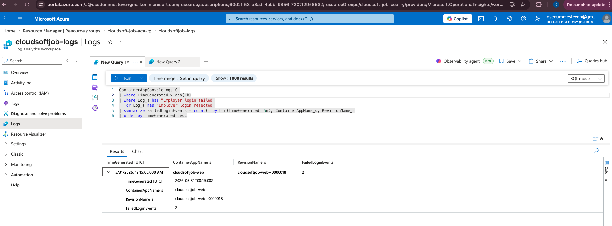

### Incident Query: Job Create Or Update Failures

Use this when employers report that job creation or activation/deactivation is not working.

```kql
ContainerAppConsoleLogs_CL
| where TimeGenerated > ago(2h)
| where Log_s has "Job creation rejected"
   or Log_s has "Job status update failed"
| project TimeGenerated, ContainerAppName_s, RevisionName_s, Log_s
| order by TimeGenerated desc
```

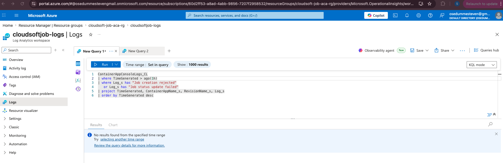

### Incident Query: Repository Fallback Or Unexpected Errors

Use this when the application is running but data behavior looks wrong.

```kql
ContainerAppConsoleLogs_CL
| where TimeGenerated > ago(2h)
| where Log_s has "failed"
   or Log_s has "exception"
   or Log_s has "Falling back to in-memory storage"
| project TimeGenerated, ContainerAppName_s, RevisionName_s, Log_s
| order by TimeGenerated desc
```

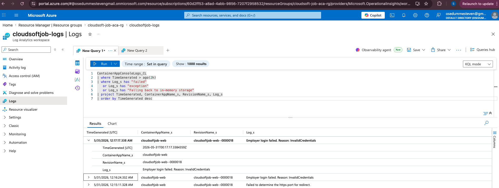

### Application Insights Query: Slow Requests

Query after the Application Insights SDK is enabled.

```kql
requests
| where timestamp > ago(15h)
| where cloud_RoleName has "cloudsoft"
| summarize RequestCount = count(), AvgDuration = avg(duration), P95Duration = percentile(duration, 95) by name, bin(timestamp, 5m)
| order by P95Duration desc
```

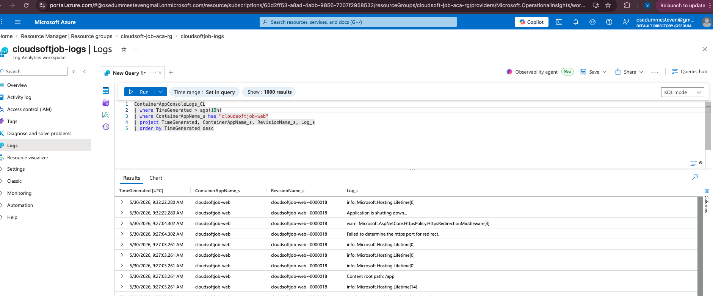

### Application Insights Query: Correlate One Failed Operation

Query after the Application Insights SDK is enabled with `operation_Id`.

```kql
union requests, traces, exceptions, dependencies
| where timestamp > ago(2h)
| where operation_Id == "<operation-id>"
| order by timestamp asc
```

## Step 8: Why Structured Logging Is Better Than Free Text

Structured logging keeps important values as named properties:

```csharp
_logger.LogInformation(
    "Job created. JobPostingId: {JobPostingId}, EmployerId: {EmployerId}, IsActive: {IsActive}",
    jobPosting.Id,
    jobPosting.EmployerId,
    jobPosting.IsActive);
```

This is better than:

```csharp
_logger.LogInformation($"Job {jobPosting.Id} was created by {jobPosting.EmployerId}");
```

Structured logs are better because:

- Queries can filter by property names such as `JobPostingId` or `EmployerId`.
- Dashboards can group by values without parsing strings.
- Alert rules can count specific event types.
- Log messages remain consistent across code changes.
- Sensitive values are easier to control because each logged value is intentional.

## Step 9: Verify Locally

Run the web app:

```bash
dotnet run --project src/Cloudsoft.Web
```

Exercise the flows:

1. Open the login page.
2. Try an invalid login.
3. Log in as an employer.
4. Create a job posting.
5. Activate or deactivate a job posting.
6. Watch the terminal output for structured log messages.

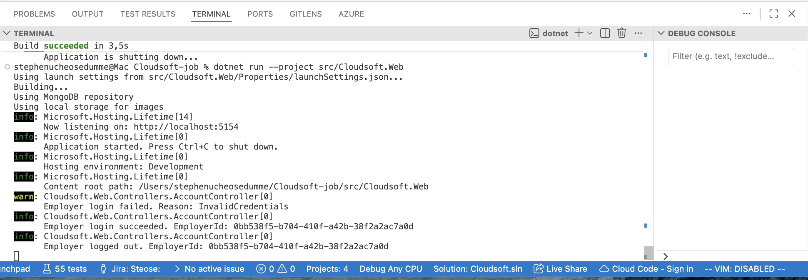
