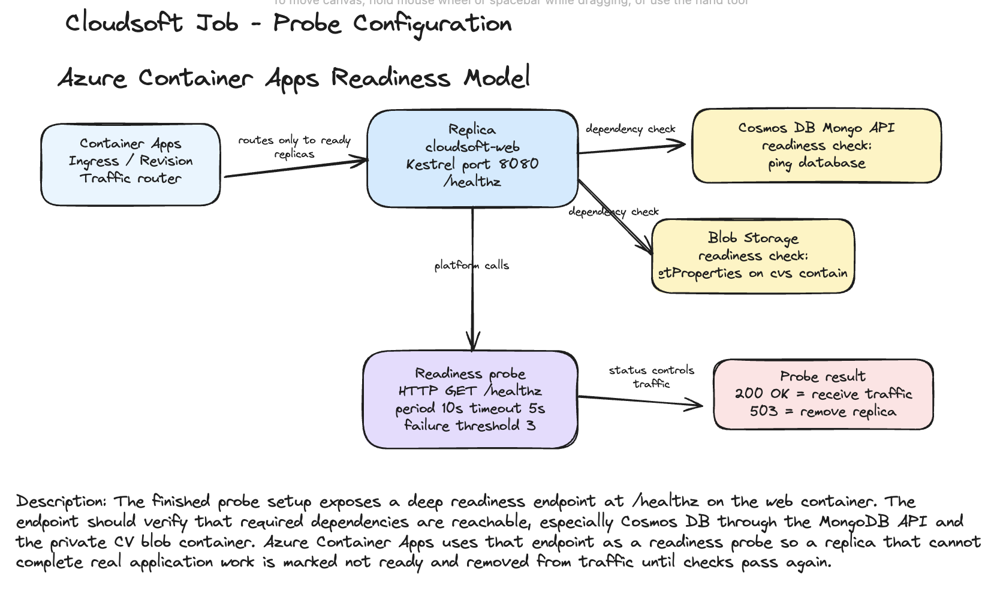

# File Upload And Health Probes

## Goal

A production-ready upload path that stores applicant files in Azure Blob Storage, then expose a deep health probe that reports whether the app can reach its required dependencies.

For Cloudsoft Job, the natural upload feature is the existing job application CV upload flow.

## Upload Feature

The web app accepts a CV file when a candidate applies for a job:

- Controller: `src/Cloudsoft.Web/Controllers/JobsController.cs`
- Action: `POST /Job/Apply`
- Service: `src/Cloudsoft.Core/Services/JobApplicationService.cs`
- Storage abstraction: `ICvStorageService`

The web app registers `LocalCvStorageService`, which writes uploaded CVs under:

```text
wwwroot/uploads/cvs
```

The Azure version keep the same application flow but replace the storage implementation with an Azure Blob implementation.

## What Is Uploaded

The uploaded file is the candidate's CV.

Allowed file types are already enforced by `LocalCvStorageService`:

```text
.pdf
.doc
.docx
```

The same validation should be kept in an Azure Blob implementation.

## Who Uploads It

The uploader is an anonymous job applicant.

The applicant opens a job details page, fills in the application form, attaches a CV, and submits the form. The applicant does not need an employer account.

Employer users create and manage job postings, but they are not the role uploading CV files in this flow.

## Where It Ends Up

Uses a private Azure Blob container for CV files, for example:

```text
cvs
```

Do not store CV files in the existing public `images` container. The `images` container is public because browsers need to load assets such as `hero.png` directly. CVs contain personal data and should not be publicly readable.

A practical blob naming pattern is:

```text
job-applications/{jobPostingId}/{applicationId}/{storedFileName}
```

Example:

```text
job-applications/engineering-lead/4f2d6d9c2c9c4c4ab6e6ac21901c4f02/7ad9c7d7f90a4b08a8e8f8f011f2e8a4.pdf
```

The app should store only the blob name or blob path on `JobApplication.CvFileName`, not a public URL.

## Managed Identity Authentication

The Container App authenticate to Blob Storage with its managed identity. It does not use a storage account key or connection string.

The app code uses Azure SDK credential chaining:

```csharp
using Azure.Identity;
using Azure.Storage.Blobs;

var credential = new DefaultAzureCredential();
var containerClient = new BlobContainerClient(
    new Uri("https://<storage-account>.blob.core.windows.net/cvs"),
    credential);
```

In Azure Container Apps, `DefaultAzureCredential` uses the Container App managed identity. Locally, it can use developer credentials from Azure CLI or Visual Studio.

The managed identity needs a data-plane RBAC role on the storage account or container:

```text
Storage Blob Data Contributor
```

In Bicep, that role assignment is scoped to the storage account or, preferably, the CV container if the template models the container scope:

```bicep
var storageBlobDataContributorRoleDefinitionId = subscriptionResourceId(
  'Microsoft.Authorization/roleDefinitions',
  'ba92f5b4-2d11-453d-a403-e96b0029c9fe'
)

resource cvUploadAssignment 'Microsoft.Authorization/roleAssignments@2022-04-01' = {
  name: guid(storage.id, pullIdentity.id, storageBlobDataContributorRoleDefinitionId)
  scope: storage
  properties: {
    principalId: pullIdentity.properties.principalId
    principalType: 'ServicePrincipal'
    roleDefinitionId: storageBlobDataContributorRoleDefinitionId
  }
}
```

The app receive the Blob container URI as configuration:

```text
AzureBlob__CvContainerUrl=https://<storage-account>.blob.core.windows.net/cvs
```

That value is not a secret. The permission comes from managed identity and RBAC.

## Deep Health Probe

A shallow health endpoint only proves that the ASP.NET Core process can answer HTTP.

A deep health endpoint, for example:

```text
GET /healthz
```

Check the dependencies required for the app to serve real traffic:

- Cosmos DB through the MongoDB API
- Azure Blob Storage for CV uploads

When both dependencies are available, `/healthz` should return `200 OK`.

When a required dependency is unavailable, `/healthz` should return `503 Service Unavailable`.

Example response:

```json
{
  "status": "Unhealthy",
  "checks": {
    "cosmosdb": "Healthy",
    "blobstorage": "Unhealthy"
  }
}
```

## Cosmos DB Check

The app uses Cosmos DB through the MongoDB API. A deep health check should open the configured MongoDB client and run a command such as `ping`.

Conceptually:

```csharp
await database.RunCommandAsync<BsonDocument>(new BsonDocument("ping", 1), cancellationToken);
```

This proves that:

- the connection string is present
- the app can authenticate
- the Cosmos DB Mongo endpoint is reachable
- the configured database can be contacted

## Blob Storage Check

The Blob Storage check use the same managed identity path as the upload feature.

Conceptually:

```csharp
var containerClient = new BlobContainerClient(
    new Uri(configuration["AzureBlob:CvContainerUrl"]!),
    new DefaultAzureCredential());

await containerClient.GetPropertiesAsync(cancellationToken: cancellationToken);
```

This proves that:

- the container URI is configured
- the Container App managed identity can get a token
- RBAC has been granted
- the container exists
- Blob Storage is reachable

For a stronger write check, the probe can upload and delete a tiny temporary blob. That gives more confidence, but it also creates extra storage operations and needs careful cleanup. For readiness, checking container properties is usually enough.

## Connecting `/healthz` To Container Apps Readiness

The Container App call `/healthz` as a readiness probe.

Example Bicep shape:

```bicep
template: {
  containers: [
    {
      name: 'cloudsoft-web'
      image: '${acr.properties.loginServer}/${imageRepository}:${imageTag}'
      probes: [
        {
          type: 'Readiness'
          httpGet: {
            path: '/healthz'
            port: containerPort
            scheme: 'HTTP'
          }
          initialDelaySeconds: 10
          periodSeconds: 10
          timeoutSeconds: 5
          failureThreshold: 3
          successThreshold: 1
        }
      ]
    }
  ]
}
```

Readiness is the correct probe type for dependency availability because it controls whether the replica should receive traffic.

## What Happens When A Dependency Is Unavailable

If Cosmos DB or Blob Storage is unavailable, `/healthz` returns `503`.

The Container Apps readiness probe then marks that replica as not ready. A not-ready replica is removed from the traffic rotation, so new HTTP requests are not sent to it.

If at least one other replica is healthy, traffic continues to the healthy replica.

If all replicas are unhealthy, the Container App has no ready backend for the revision. Clients will receive failures, typically `503`, until at least one replica becomes ready again.

This behavior is useful because it prevents the platform from routing user traffic to an app instance that cannot complete real work, such as saving a job application or reading job data.

## Summary

For this app, the upload and health probe design should be:

- Upload candidate CVs from `POST /Job/Apply`.
- Store CV files in a private `cvs` Blob container.
- Keep public images in the existing public `images` Blob container.
- Authenticate to Blob Storage with the Container App managed identity and RBAC.
- Avoid storage account keys and connection strings for Blob access.
- Expose `/healthz` as a deep probe that checks Cosmos DB and Blob Storage.
- Connect `/healthz` to the Container App readiness probe.
- Let Container Apps remove unhealthy replicas from traffic when dependencies are down.


